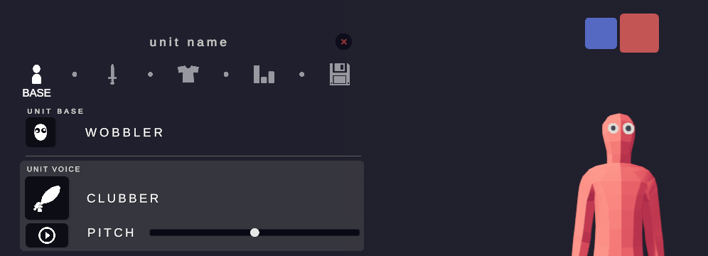

# TABS Skin Color Mod

A BepInEx plugin for **Totally Accurate Battle Simulator** (Steam, x64) that lets you
recolor the **skin (body) of Wobblers** — something the vanilla Unit Creator doesn't
expose — with the picker UI anchored right next to the **red/blue team color swatches**
in the top-right corner of the Unit Creator.

The mod works in the **Unit Creator** (live preview on the Wobbler) and in **battles**
(saved colors are applied automatically every time a unit spawns). Colors persist
across game restarts in a JSON file.



---

## How it works (the short version)

TABS colors unit bodies through `UnitColorHandler` components: materials on `TFBG/*`
shaders carry a `_Color` (the skin), and the game lerps/overwrites that color at spawn
and on death. Clothes and weapons are separate `CharacterItem` props with their own
materials and palette indexes.

The mod:

1. Hooks `Landfall.TABS.Unit.Awake()` (Harmony postfix).
2. ~0.35 s after spawn, identifies a unit's **skin materials**: renderers matching the
   unit-base prefab's own renderer paths (`UnitBlueprint.m_unitBase`), minus every
   renderer under `Unit.spawnedObjects` (clothes/weapons), on `TFBG/*` shaders with a
   `_Color` property.
3. Sets the per-unit material color (materials are instantiated so units don't share
   colors) and patches the handler's captured originals so the death-gray fade still
   works.
4. Optionally re-applies the color once per second ("sticky" mode) in case the game
   overwrites it — skipping dead units so death animations stay intact.
5. Persists colors keyed by the unit's entity name in
   `BepInEx/plugins/TabsSkinColorMod/skin_colors.json`.

## Usage in game

| Where | What |
|---|---|
| Unit Creator, top-right (next to the red/blue team squares) | **SKIN COLOR** button — opens the editor |
| Anywhere | **F8** toggles the editor window |
| Battlefield | **PICK UNIT BY CLICK** in the window, then click a unit to target it |
| Editor window | RGB sliders, HEX field, 12 swatches, RANDOM, COPY HEX |
| **SAVE TO UNIT** | stores the color for this unit (persists across battles/restarts) |
| **CLEAR SAVED** | removes the stored color |
| **RESET ORIGINAL** | restores the unit's vanilla colors for this session |
| **F9** | dumps the targeted unit's materials/shaders/handler colors to a text file (debugging) |

The editor targets the Unit Creator preview unit automatically when the UC is open;
otherwise it targets the last spawned unit (or a clicked one).

## Requirements

- Totally Accurate Battle Simulator (Steam, x64)
- BepInEx 5.4.23 (x64, Mono) — **already installed by this repo's setup** into the
  game folder (`BepInEx/`, `winhttp.dll`, `doorstop_config.ini`)

## Installing (fresh machine)

1. Install BepInEx x64 into the TABS folder (drop the BepInEx 5.4.23 `BepInEx/`
   folder next to `TotallyAccurateBattleSimulator.exe`; the repo already contains a
   copy under `third_party/bepinex_dl/bepinex/`).
2. Build the plugin (see below) — it deploys itself to `BepInEx/plugins/`.
3. Launch TABS normally through Steam. First launch initializes BepInEx.

## Building from source

You need the .NET SDK 8+ (`dotnet`). Then:

```sh
dotnet build src/TabsSkinColorMod.Plugin/TabsSkinColorMod.Plugin.csproj -c Release
```

The build references the game's DLLs and deploys automatically. Override the game
path if yours differs:

```sh
dotnet build src/TabsSkinColorMod.Plugin/TabsSkinColorMod.Plugin.csproj -c Release \
  -p:TABS_DIR="D:\Games\Totally Accurate Battle Simulator"
```

Project layout:

```
src/TabsSkinColorMod.Core/       engine-free logic (colors, pattern matching, JSON store)
src/TabsSkinColorMod.Plugin/     the BepInEx plugin (hooks, tint engine, IMGUI editor)
tests/TabsSkinColorMod.Core.Tests/   xunit tests for the core library
tests/TabsSkinColorMod.TestsRunner/  standalone reflective test executor (no xunit engine)
tools/MetaDump/                  offline metadata dumper used to discover the game API
docs/hook-map.md                 the discovered TABS internals this mod relies on
```

Run the core tests (uses the reflective runner; plain `dotnet test` also works on a
normal machine):

```sh
dotnet run --project tests/TabsSkinColorMod.TestsRunner
```

## Configuration

`BepInEx/config/com.freebuff.tabs.skincolor.cfg`:

| Key | Default | Meaning |
|---|---|---|
| `EditorHotkey` | F8 | Toggle the editor window |
| `DumpHotkey` | F9 | Dump last unit's material info |
| `EnableInBattle` | true | Apply saved colors in battles |
| `EnableInUnitCreator` | true | Apply colors to the UC preview |
| `StickyReapply` | true | Re-apply the color if the game overwrites it |
| `LogSkinMaterials` | false | Log skin material names per unit |
| `MaterialNameFilter` | *(empty)* | Optional comma patterns like `skin, body, -cloth` to narrow skin detection |

## Troubleshooting

- **No color change on a unit** — press F9 with the unit targeted and check
  `BepInEx/plugins/TabsSkinColorMod/dump_*.txt`. If the body material isn't being
  caught, set `MaterialNameFilter` to part of its name (e.g. `wobblerskin`).
- **Mod not loading** — check `BepInEx/LogOutput.log`; the mod logs
  `Harmony: hooked Landfall.TABS.Unit.Awake` on success.
- **Multiplayer** — colors are cosmetic and local-only; other players won't see them.

## Limitations / notes

- Colors are keyed by the unit's entity name; two custom units with identical names
  share a color entry.
- Game updates can shift internals — re-run `tools/MetaDump` and compare
  `docs/hook-map.md`.
- The UC team swatches still switch team *preview* colors for clothes; the mod only
  overrides the body skin.

## Credits

Internals discovered via offline IL inspection (Mono.Cecil) of `Assembly-CSharp.dll` —
see `docs/hook-map.md`. Built with BepInEx 5 + HarmonyX.
